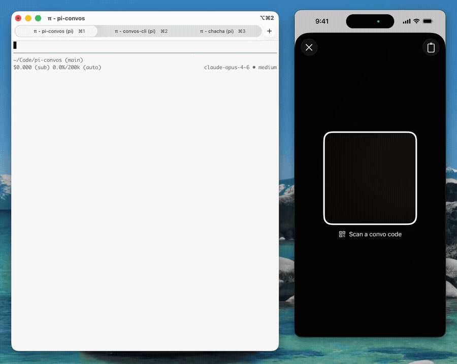

# pi-convos

A [pi](https://github.com/badlogic/pi-mono) package that connects AI agents to [Convos](https://convos.org) — privacy-focused ephemeral messaging built on [XMTP](https://xmtp.org).



## What it does

Gives your pi agent a real-time messaging channel. Users scan a QR code to join, and messages flow directly into the agent's conversation loop — no polling required.

- **`/convos-start`** — Creates a conversation, shows a QR code invite, and starts listening
- **Messages interrupt the agent** — When a user sends a message on Convos, it arrives as a new turn
- **`convos_send` tool** — The LLM replies by calling a tool (text or reply-to)
- **`convos_react` tool** — The LLM reacts to messages with emoji
- **Join requests auto-processed** — New members are added automatically in the background
- **Conversation persistence** — Conversations are saved per git worktree and resumed automatically

## Requirements

- [pi](https://github.com/badlogic/pi-mono) (the coding agent)
- [@convos/cli](https://github.com/xmtplabs/convos-cli) installed globally:

```bash
npm install -g @convos/cli
convos init
```

## Install

```bash
# From git
pi install git:github.com/yewreeka/pi-convos

# Or from a local path (for development)
pi install /path/to/pi-convos
```

> **Note:** Only install from one source. If you switch between git and local, remove the old one first with `pi remove`.

## Usage

Start pi, then:

```
/convos-start
```

The agent will:
1. Create a new Convos conversation (named after your project + branch)
2. Show a QR code invite inline
3. Listen for messages in the background
4. Resume the same conversation next time you start pi in this worktree

When someone joins and sends a message, the agent gets interrupted and can respond naturally. Terminal messages get terminal responses, Convos messages get Convos responses.

### Commands

| Command | Description |
|---------|-------------|
| `/convos-start [args]` | Start the agent. Args are passed to `convos agent serve` |
| `/convos-stop` | Stop the agent |
| `/convos-status` | Show status (conversation ID, invite URL) |

### Tools (available to the LLM)

| Tool | Description |
|------|-------------|
| `convos_send` | Send a text message (with optional `replyTo`) |
| `convos_react` | React to a message with an emoji |

### Examples

```
# Start with defaults
/convos-start

# Start with custom name
/convos-start --name "Code Review Bot" --profile-name "🔍 Reviewer"

# Attach to an existing conversation
/convos-start <conversation-id>

# Admin-only permissions (only creator can add members)
/convos-start --name "Private" --permissions admin-only
```

## How it works

```
┌─────────────────────────────────────┐
│              pi agent               │
│                                     │
│  pi-convos extension                │
│  ├─ /convos-start command           │
│  ├─ convos_send tool                │
│  ├─ convos_react tool               │
│  └─ background event listener ──────┼──── pi.sendMessage()
│       (reads child stdout)          │     triggers new turn
│                                     │
│  ┌───────────────────────────────┐  │
│  │  convos agent serve (child)   │  │
│  │  ├─ XMTP message stream      │  │
│  │  ├─ Join request stream       │  │
│  │  └─ stdin command reader      │  │
│  └───────────────────────────────┘  │
└─────────────────────────────────────┘
         │              ▲
         ▼              │
    ┌─────────────────────┐
    │    XMTP Network     │
    └─────────────────────┘
         │              ▲
         ▼              │
    ┌─────────────────────┐
    │  Convos App (iOS)   │
    │  or other clients   │
    └─────────────────────┘
```

## License

MIT
