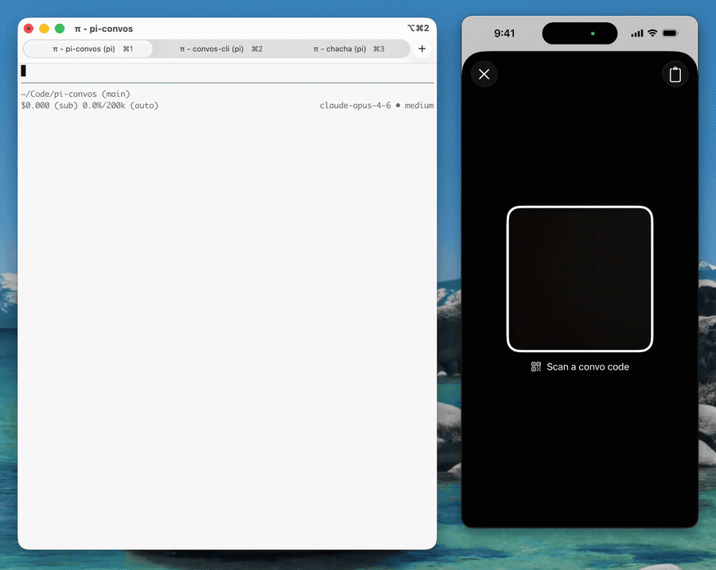

# pi-convos

A [pi](https://github.com/badlogic/pi-mono) package that connects AI agents to [Convos](https://convos.org) — privacy-focused ephemeral messaging built on [XMTP](https://xmtp.org).



## What it does

Gives your pi agent a real-time messaging channel. Users scan a QR code to join, and messages flow directly into the agent's conversation loop — no polling required.

Works in two modes:

- **Interactive (TUI)** — user starts with `/convos-start`, sees QR code inline, terminal vs Convos messages are routed separately
- **Headless** — auto-starts on `session_start` when no UI is available, catches up on missed messages between sessions, logs to stdout

### Features

- **`/convos-start`** — Creates a conversation, shows a QR code invite, and starts listening
- **Messages interrupt the agent** — When a user sends a message on Convos, it arrives as a new turn
- **`convos_send` tool** — The LLM replies by calling a tool (text or reply-to)
- **`convos_react` tool** — The LLM reacts to messages with emoji
- **`convos_send_file` tool** — Send file attachments to the conversation (uses stdin protocol)
- **`convos_rename` tool** — Rename the conversation
- **`convos_update_profile` tool** — Update the agent's display name and avatar
- **`convos_lock` / `convos_unlock` tools** — Lock or unlock the conversation to control membership
- **`convos_explode` tool** — Permanently destroy the conversation (immediate or scheduled)
- **Join requests auto-processed** — New members are added automatically in the background
- **Conversation persistence** — Conversations are saved and resumed automatically
- **Missed message catch-up** — In headless mode, messages sent while the agent was offline are fetched and injected on startup
- **Heartbeat monitoring** — Configurable heartbeat events for health monitoring in headless mode
- **Isolated state** — Each pi session gets its own Convos data directory (`--home`)

## Requirements

- [pi](https://github.com/badlogic/pi-mono) (the coding agent)
- [@convos/cli](https://github.com/xmtplabs/convos-cli) installed globally:

```bash
npm install -g @convos/cli
```

> **Note:** You do _not_ need to run `convos init` manually — the extension auto-initializes on first use.

## Install

```bash
# From git
pi install git:github.com/yewreeka/pi-convos

# Or from a local path (for development)
pi install /path/to/pi-convos
```

> **Note:** Only install from one source. If you switch between git and local, remove the old one first with `pi remove`.

## Data isolation

All Convos state (identities, cryptographic keys, XMTP databases, session state) is stored in a dedicated home directory. Every `convos` CLI invocation uses `--home` to keep state isolated per pi session context.

**Default location:** `<git-worktree>/.pi/convos/`

This means each project/worktree gets its own Convos identity. Override with the `CONVOS_HOME` environment variable.

If no git worktree is detected, falls back to `/tmp/.pi-convos`.

## Usage — Interactive Mode

Start pi, then:

```
/convos-start
```

The agent will:
1. Auto-initialize a Convos identity in `.pi/convos/` (first run only)
2. Create a new Convos conversation (named after your project + branch)
3. Show a QR code invite inline
4. Listen for messages in the background
5. Resume the same conversation next time you start pi in this worktree

When someone joins and sends a message, the agent gets interrupted and can respond naturally. Terminal messages get terminal responses, Convos messages get Convos responses.

### Commands

| Command | Description |
|---------|-------------|
| `/convos-start [args]` | Start the agent. Args are passed to `convos agent serve` |
| `/convos-stop` | Stop the agent |
| `/convos-status` | Show status (conversation ID, invite URL) |

### Examples

```
# Start with defaults
/convos-start

# Start with custom name
/convos-start --name "Code Review Bot" --profile-name "🔍 Reviewer"

# Attach to an existing conversation
/convos-start <conversation-id>

# Admin-only permissions (only creator can add members)
/convos-start --name "Private" --permissions admin-only

# With a conversation description
/convos-start --name "Support Bot" --description "Ask me anything about the API"

# With heartbeat monitoring (every 30 seconds)
/convos-start --heartbeat 30
```

## Usage — Headless Mode

When pi runs without a UI (e.g. via the SDK's `createAgentSession()` + `session.prompt()`), Convos auto-starts on `session_start`. Configure via environment variables:

| Variable | Description | Default |
|----------|-------------|---------|
| `CONVOS_HOME` | Path to Convos data directory | `<worktree>/.pi/convos` |
| `CONVOS_NAME` | Conversation name | _(derived from project + branch)_ |
| `CONVOS_DESCRIPTION` | Conversation description | _(none)_ |
| `CONVOS_PROFILE_NAME` | Profile name shown to members | `"Pi"` |
| `CONVOS_PERMISSIONS` | Permission preset: `"all-members"` or `"admin-only"` | `"all-members"` |
| `CONVOS_HEARTBEAT` | Heartbeat interval in seconds (0 to disable) | _(disabled)_ |
| `CONVOS_LOG_LEVEL` | Log level: `off\|error\|warn\|info\|debug\|trace` | _(default)_ |

### Example: SDK integration

```typescript
import { createAgentSession, DefaultResourceLoader } from "@mariozechner/pi-coding-agent";

// Configure headless Convos via env vars
process.env.CONVOS_HOME = "/path/to/agent/.convos";
process.env.CONVOS_NAME = "My Agent";
process.env.CONVOS_HEARTBEAT = "30";

const resourceLoader = new DefaultResourceLoader({
  cwd: process.cwd(),
  additionalExtensionPaths: ["/path/to/pi-convos/extensions/convos-agent.ts"],
});
await resourceLoader.reload();

const { session } = await createAgentSession({
  model: myModel,
  resourceLoader,
});

// Bind extensions — this fires session_start, which auto-starts Convos
await session.bindExtensions({});

// Agent can now send/receive Convos messages via tools
await session.prompt("Check for messages and start working.");
```

### Headless features

- **Auto-start** — Convos agent starts automatically when `ctx.hasUI` is false
- **Auto-init** — If the Convos home directory doesn't have a `.env`, `convos init` is run automatically
- **Missed message catch-up** — On startup, fetches messages sent after the last seen timestamp and injects them as a steer message
- **Session persistence** — Conversation ID and last-seen timestamp persist across restarts
- **QR code output** — Prints QR code via iTerm2 inline image protocol for terminal consumers
- **Console logging** — Messages, joins, and errors are logged to stdout/stderr
- **Heartbeat logging** — When `CONVOS_HEARTBEAT` is set, periodic health checks are logged

## Tools (available to the LLM)

| Tool | Description |
|------|-------------|
| `convos_send` | Send a text message (with optional `replyTo`) |
| `convos_react` | React to a message with an emoji |
| `convos_send_file` | Send a file attachment (with optional `replyTo`) |
| `convos_rename` | Rename the conversation |
| `convos_update_profile` | Update display name and/or avatar image |
| `convos_lock` | Lock the conversation (prevent new joins, invalidate invites) |
| `convos_unlock` | Unlock the conversation (allow new joins) |
| `convos_explode` | Permanently destroy the conversation (immediate or scheduled) |

## How it works

```
┌─────────────────────────────────────┐
│              pi agent               │
│                                     │
│  pi-convos extension                │
│  ├─ /convos-start command (TUI)     │
│  ├─ session_start handler (headless)│
│  ├─ convos_send tool                │
│  ├─ convos_react tool               │
│  ├─ convos_send_file tool           │
│  ├─ convos_rename tool              │
│  ├─ convos_update_profile tool      │
│  ├─ convos_lock / convos_unlock     │
│  ├─ convos_explode tool             │
│  └─ background event listener ──────┼──── pi.sendMessage()
│       (reads child stdout)          │     triggers new turn
│                                     │
│  ┌───────────────────────────────┐  │
│  │  convos agent serve (child)   │  │
│  │  --home .pi/convos/           │  │
│  │  ├─ XMTP message stream      │  │
│  │  ├─ Join request stream       │  │
│  │  ├─ Heartbeat emitter         │  │
│  │  └─ stdin command reader      │  │
│  └───────────────────────────────┘  │
└─────────────────────────────────────┘
         │              ▲
         ▼              │
    ┌─────────────────────┐
    │    XMTP Network     │
    └─────────────────────┘
         │              ▲
         ▼              │
    ┌─────────────────────┐
    │  Convos App (iOS)   │
    │  or other clients   │
    └─────────────────────┘
```

## License

MIT
